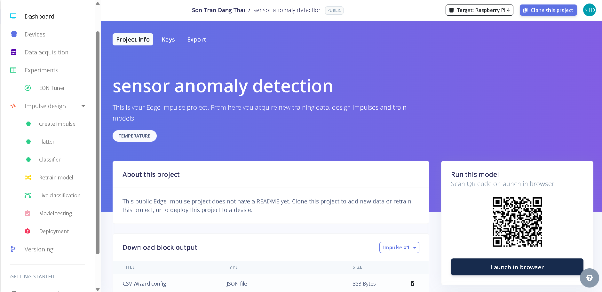
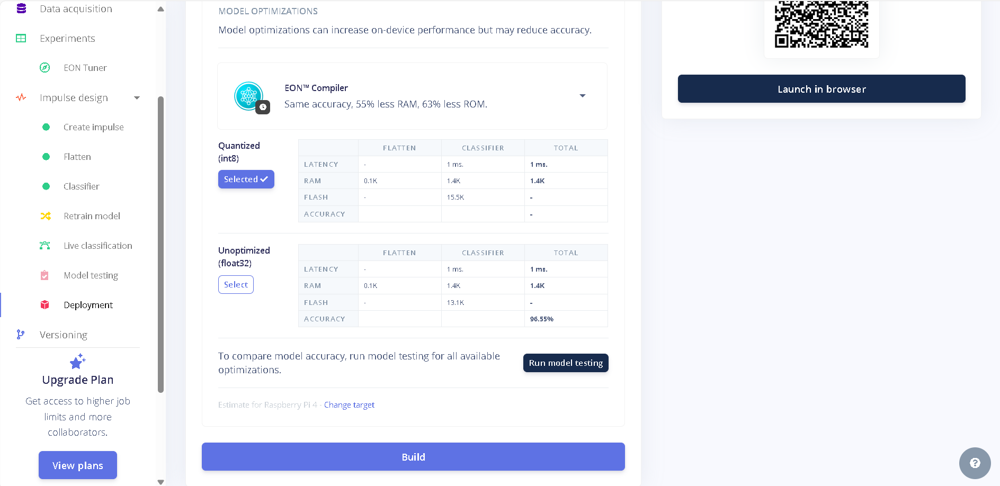
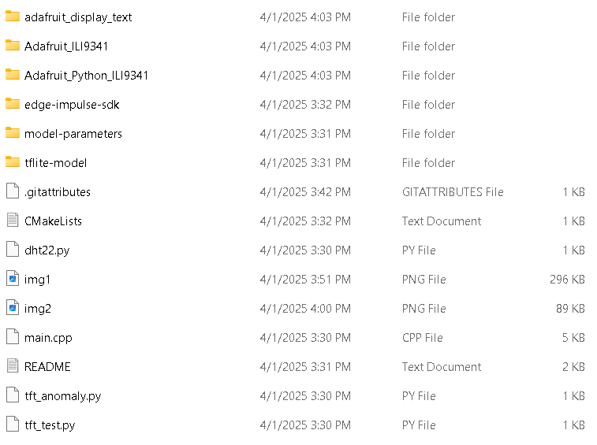

# Project Title

A AIoT project that can detect when room temperature sudden increase or decrease


## Installation

__Install my Edge Impulse model__

go to https://studio.edgeimpulse.com/public/630942/latest

Click "Clone this project" on the top right conner



Install my-project with npm

Go to "Deployment" and Build the project as a C++ library



It will install a zip file, unzip it and add this project into it



Compile C++ code 

```bash
  make
```

Run

```bash
  ./build/app
```

    